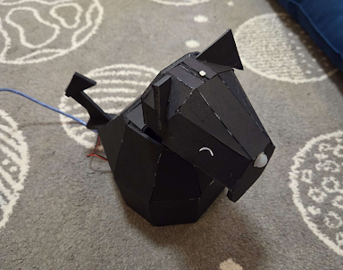

# Pets Please Pablo
A robot dog who asks for attention when you're nearby. He wags his tail while you're petting him and gives up if it's been too long since he sensed motion before being pet.

An Arduino Uno, 2 servos (to drive his neck and tail), a small PIR motion sensor for a nose, and a photocell on top of his head.

See a short demo video [here](https://drive.google.com/file/d/1NUOmm9ZIzFtNFKRjC8tsPDJTLtQjNFsr/view?usp=sharing).

See a lesson plan for creating a Pets Please Pal of your own [here](https://docs.google.com/document/d/1Aju9yzI73tjPbmLy6xo4HVvZcvHvG3qowszpZ9o93cU/edit?usp=sharing).

This was the midterm electronics project for ENGR210/PHYS210 at Wellesley College in March, 2025.